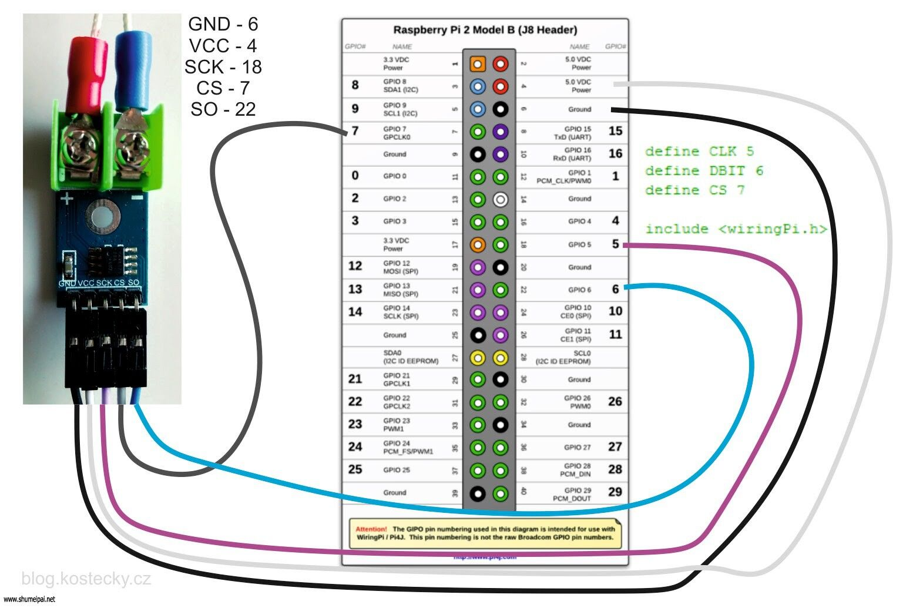

# Max6675

Read the temperature with K-type thermocouple. Raspberry pi NodeJS.

Get the code from github.

```sh
git clone https://github.com/bubao/Max6675-Raspberry-pi-nodejs.git
```

Change values in `test.js`.

```js
const CS = 7;
const SCK = 18;
const SO = 22;
```



Install dependency packages.

```shell
cd Max6675-Raspberry-pi-nodejs
npm i
```

Test.

```sh
npm run test
```