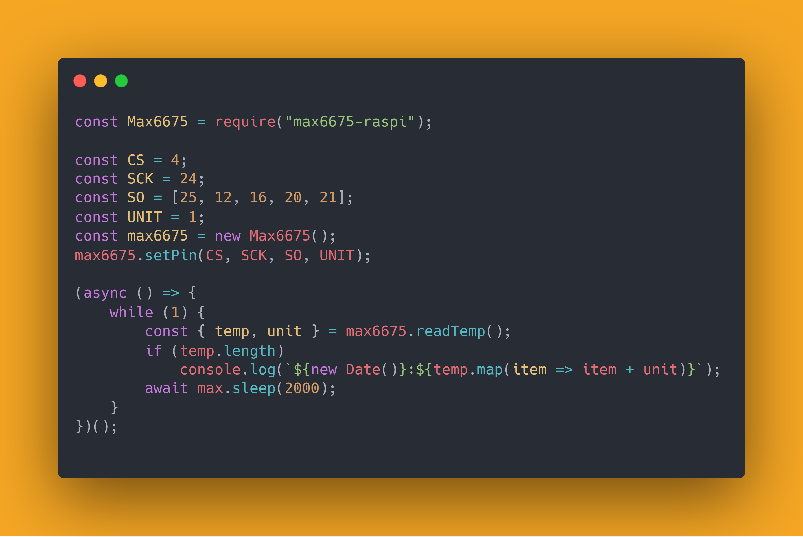

# Max6675

[](https://www.npmjs.com/package/max6675-raspi)

English|[中文](./REAME.cn.md)

Read the temperature with K-type thermocouple. Raspberry pi NodeJS.

Get the code from npmjs.

```sh
npm i max6675-raspi --save
```



## GPIO

[](https://github.com/splitbrain/rpibplusleaf)